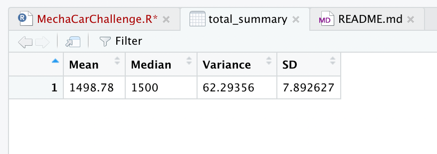
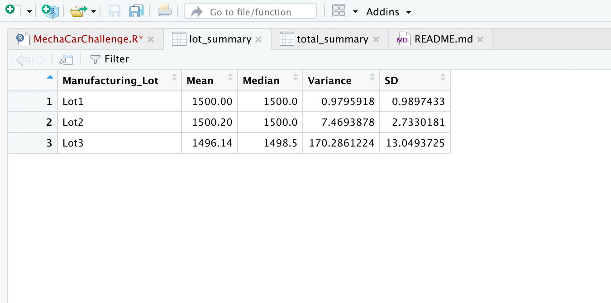
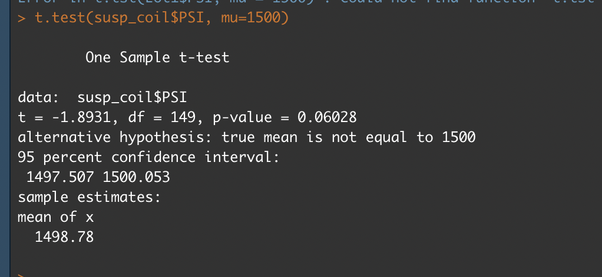

# MechaCar_Statistical_Analysis

## Project Overview 

The purpose of this project is to analyze metrics that can effect the manufacturing a new car prototype and compare vehicle performances. the metrics include vehicle_length,vehicle_weight,spoiler_angle,ground_clearance,AWD,mpg and PSI.

[MechaCarChallenge.R](MechaCarChallenge.r) -  Analysis made for this project 

## Linear Regression to predict MPG

#### Summary 

1. The intercept,vehicle_length and ground_clearance coeeficients can be said to provide a non-random amount of variance to the mpg values 

2. As the significant values is 0.05, we were able to reject the null hypothesis because of the small p-value.Thus proving that slope is not 0.

3. An Adjusted R-square of 0.6825 concludes that linear regression model can predicts the mpg of MechaCar prototypes effectively.

## Summary Statistics on Suspension Coils 

#### Summary 

By looking at the overall variance of the entire dataset shows that current manufacturing meets the 100 pounds per square inch. But when we separate into 3 lots ,the 3rd lot shows much higher variance, because of the analysis the 3rd lot does not meet the design specification requirement.

## T-Tests on Suspension Coils

#### summary 

For Lot 1 - As the significant value is 0.05, we cannot reject the null hypothesis as the p-value is 1

For Lot 2 -  As the significant value is 0.05, we cannot reject null hypothesis as the p-value is 0.6072

For Lot 3 -  As the significant value is 0.05, we can reject null hypothesis as the p-value is 0.04168

## Study design : Mechacar Vs Competition

One more way to perform Statistical study is to determine if MechaCar's standing against its competition is doing a linear regression on city and highway fuel efficiency. As fuel is very expensive these days, it would be an must feature to include for the consumers to look into while purchasing the new car.

The metrics that could be included for testing are

1. City and Highway fuel efficiency  as dependent variable 
2. Horse power as independent variable 
3. Cost  as dependent variable 
4. Maintenance cost as dependent variable . 

