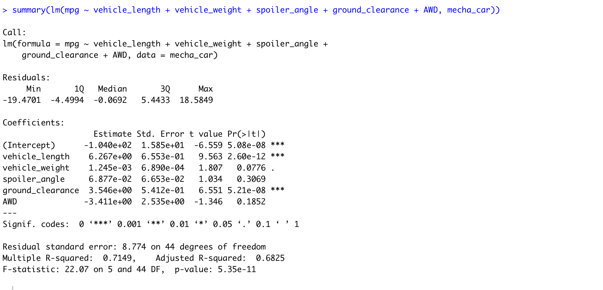

# MechaCar_Statistical_Analysis

## Project Overview 

The purpose of this project is to analyze metrics that can effect the manufacturing a new car prototype and compare vehicle performances. the metrics include vehicle_length,vehicle_weight,spoiler_angle,ground_clearance,AWD,mpg

### Linear Regression to predict MPG

[MechaCarChallenge.R](MechaCarChallenge.r) -  file related to the Linear regression 

